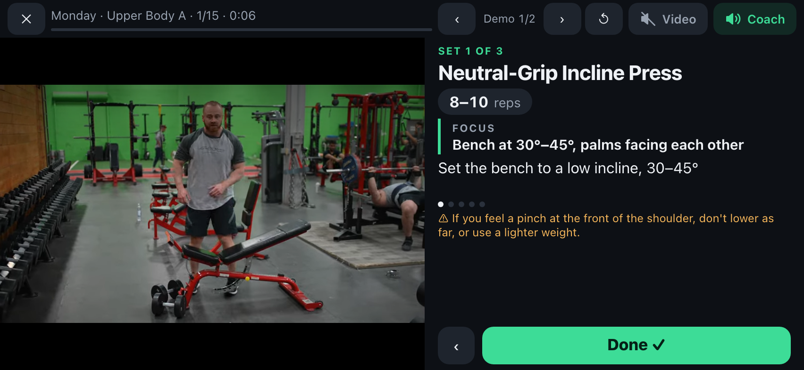

# Workout Coach

**A workout plan turned into a coached session you follow on your TV, and a way for anyone to get their own plan by chatting with an AI.**
Human demo videos, a calm coach voice, timers and form cues. Your phone is the remote.

**Try it:** https://ashwinr93.github.io/workout/



## Why this exists

I had a good workout plan: a PDF with a joint-friendly, four-day split, safety rules and a stretching routine. I also had a small home setup: **a pair of dumbbells, an adjustable bench and a yoga mat**. What I didn't have was a way to *follow* the plan mid-workout without squinting at a PDF between sets or guessing whether my form was right.

So I turned the PDF into this. I open it on my iPhone, mirror the screen to the TV and work out in front of it:

- a person on the TV shows each movement;
- a coach voice talks me through the set, with the one thing to remember saved for last;
- rest timers count down and tell me what's next;
- my phone stays in my hand as the remote. **Done** moves to the next set.

The plan it opens with is mine. It covers the plan's warm-up, the day's exercises and the cool-down stretches, all using only the equipment I own. Every exercise names *when to back off*, because the whole point is to train around my joints, not through them.

<p>
  
  
</p>

## Using it: tips

**Make it an app on your phone.**
- iPhone: open the site in Safari → Share → **Add to Home Screen** (keep "Open as Web App" on).
- Android: open it in Chrome → ⋮ → **Add to Home screen**.

It then opens full-screen like an app, with no browser bars.

**Put it on the TV.**
- iPhone to an AirPlay TV: turn **Rotation Lock off** and hold the phone sideways. Then open Control Center → **Screen Mirroring** and pick the TV. Landscape fills the TV.
- Android: use **Cast screen** / Smart View to a Chromecast or smart TV.
- A laptop works too: HDMI, or cast the browser tab.

**Control it from the phone.**
- **Done** ends a set and starts the rest.
- **‹** goes back a step, and **✕** (tap twice) leaves the workout.
- **‹ ›** at the top switch between alternate demo videos. Your choice is remembered per exercise.

**Pick one voice.**
- **Coach** (the default) talks you through the set.
- **Video** plays the demo's own audio. On demos with no voice, the coach fills in.
- Tap **Coach** again to silence everything.

**Warm-up and cool-down** are on by default. Turn either off on the day screen.

**Preview** any exercise from the day screen to learn it before you start.

There are no accounts, no tracking and no ads (every demo video is checked for ads). Nothing leaves your phone except the YouTube embeds.

## Get your own plan (no code needed)

Tap **Create your own plan** on the home screen and pick an AI you already use (ChatGPT, Claude, Gemini, Copilot, Perplexity, Grok or Le Chat). It opens a new chat with a message that turns the AI into a coach: it asks about your goals, any aches, where you train (at home or in a gym) and how much time you have, one question at a time, then gives you a link. Tap the link and your plan opens in the app, with the same videos, coach voice and timers.

- **It's free.** The AI runs on your own account; this site has no server.
- **Your plan lives in its link.** Bookmark it or add it to your Home Screen. The app also remembers the last plan you opened on that phone.
- **Private.** Your answers stay in your AI chat. The link holds only exercise names and numbers, and the part after `#` is never sent to any server.
- **Changing it later:** open your plan and tap **Change it with AI**. The AI gets your current plan and gives you a new link.
- **Cardio and sport** become activity days (a walk, a run, your football match), with the warm-up before and the stretches after.
- If an AI makes a mistake in the link, the app says what's wrong and gives you a message to paste back into the chat.

Gemini can't receive a message through a link, so for Gemini the app copies the message and you paste it in.

The AI can only choose from the app's exercise library, where every exercise has a checked demo video, cues that match it and a recorded coach voice. The library is growing.

## Make it yours with code

If you'd rather run your own copy (your own exercises, videos and wording), fork this repo. There's no build step: it's plain HTML, CSS and JavaScript.

| File | What's in it |
|---|---|
| [`library.js`](library.js) | Every exercise: name, cues, safety line, demo videos, default sets/reps; the warm-up, cool-down and activities |
| [`plan.js`](plan.js) | The plan link format, and the example plan the app opens with (`EXAMPLE_PLAN`) |
| [`speech.js`](speech.js) | Everything the coach says, and how names are pronounced (`SPOKEN_NAMES`) |
| [`prompt.js`](prompt.js) | The message that turns an AI chat into a coach that writes plans |

The easiest way is to hand the job to an AI coding assistant such as [Claude Code](https://claude.com/claude-code). [`CLAUDE.md`](CLAUDE.md) already explains how the app is built and the rules that keep it good: one movement per exercise, cues that match the demo, ad-free videos, and wording that sounds natural out loud.

### A plan

A plan is one line, the same one the AIs write:

```
v1/t:Home-Strength/mon:Full-Body-A:boxsquat.3x10-12,sarow.3x10,planktaps.3x30s/wed:Brisk-Walk:walk.30m/sun:Stretch:couch.1x60s
```

Each day is `mon`…`sun`, a name, then exercises as `id.SETSxREPS` (or a range like `10-12`), `id.SETSxSECONDSs` for holds, or one activity like `walk.30m`. Put yours in `EXAMPLE_PLAN` to make it the one the app opens with, or just open `your-site/#` followed by the line.

### An exercise

```js
rdl: {
  name: "Romanian Deadlift", sets: 3, reps: "8–10", unit: "reps", rest: 90,   // defaults; plans set their own
  equip: "dumbbells", about: "hamstrings, glutes; no stress on the knee",    // what the AI sees
  key: "Hinge at the hips with soft knees",               // the Focus: the one thing that matters most
  cues: ["Stand tall with your chest up and core tight",    // in the order the demo shows them
         "Push your hips back as if touching a wall behind you", "..."],
  stop: "If you feel it in your lower back, stop before your back rounds.",
  videos: [{ id: "YouTube id", start: 5, end: 40 }]       // main demo first, then alternates
},
```

Holds use `time: 30` (seconds) instead of `reps`. Add `perSide: true` for one side at a time, `kind: "stretch"` for stretches, and `voice: true` to a video when someone talks in it.

### The coach's voice

It works straight away: any phrase without a recording is spoken by the phone's built-in voice. For the natural voice you hear on the live site, record your phrases with the free, offline [Kokoro](https://github.com/thewh1teagle/kokoro-onnx) model. Setup is in the header of [`tools/make_audio.py`](tools/make_audio.py):

```bash
.venv/bin/python tools/make_audio.py --models <folder with the Kokoro model files>
```

It records only new or changed phrases (including every rep count and hold time a plan can ask for) and removes clips you no longer use.

### Publish it for free

In your fork on GitHub, go to **Settings → Pages → Deploy from a branch → `main`, `/ (root)`**. A minute later it's live at `https://<you>.github.io/<repo>/`. Change `SITE` in `prompt.js` to that address so the AIs link to your copy.

### Check it

- Add `?selftest` to your site's address (or run `python3 -m http.server` in the folder and open `localhost:8000/?selftest`). It runs every day's session in seconds on a simulated clock and checks the timing, the sound buttons, the wording, the plan links and whether the layout fits a phone. (Until you record your own voice clips, it will list the phrases without a recording.)
- [`tests/e2e`](tests/e2e) has deeper checks with real browsers and real YouTube, plus an ad scanner for demo videos (`ad-scan.mjs`). [`screenshots.mjs`](tests/e2e/screenshots.mjs) regenerates the images in this README.

## A note on safety

This is a player for a plan, not medical advice. The cues and "back off" lines come from my plan and the demo videos, and the AI is told to send anyone with warning signs (chest pain, dizziness, recent surgery, severe pain) to a doctor or physiotherapist first. If you have an injury, get your plan from a professional.

## Demo videos

<!-- credits:start -->
Every demo is the creator's own video, played through YouTube's embedded player (start and end points only; nothing is downloaded or edited). Thank you to these 41 channels:

- **[Advanced Therapy and Performance](https://www.youtube.com/@advancedtherapyperformance)**: [90/90 Hip Swivels](https://www.youtube.com/watch?v=YxECcOkUCEY)
- **[Andrew Coates](https://www.youtube.com/@Andrewcoatesfitness)**: [Neutral-Grip Incline Press](https://www.youtube.com/watch?v=2SU_K4-knrc)
- **[Atomic Athlete](https://www.youtube.com/@atomic.athlete)**: [Pigeon Pose](https://www.youtube.com/watch?v=1o7awuDGzag)
- **[BEN MIGHTY](https://www.youtube.com/@BENMIGHTY85)**: [Chest-Supported Incline Row](https://www.youtube.com/watch?v=ym-Mp8tCF00)
- **[Brian DeBaets](https://www.youtube.com/@briandebaets3041)**: [Box Squat to Bench](https://www.youtube.com/watch?v=DqWrOnzZ5No)
- **[Brittany Kohnke](https://www.youtube.com/@TheBrittanyKohnke)**: [Y-T-W Raises](https://www.youtube.com/watch?v=OFQduBFpDrY)
- **[Broser Built](https://www.youtube.com/@BroserBuilt)**: [Incline Hammer Curls](https://www.youtube.com/watch?v=cbRSu8Ws_hs)
- **[California Department of Public Health](https://www.youtube.com/@CAPublicHealth)**: [Cat-Cow → Child's Pose](https://www.youtube.com/watch?v=vuyUwtHl694)
- **[Catalyst Physical Therapy & Wellness](https://www.youtube.com/@catalystptandwellness)**: [Figure-4 Stretch](https://www.youtube.com/watch?v=xVq2-g_leTI)
- **[Champion Physical Therapy and Performance](https://www.youtube.com/@championptp)**: [Suitcase Carries](https://www.youtube.com/watch?v=3RKKnZhhelE)
- **[Dr. Christy Lee](https://www.youtube.com/@itiswellptllc)**: [Arm Circles](https://www.youtube.com/watch?v=ndmSvkEdNQQ)
- **[FITTR](https://www.youtube.com/@FITTRwithSquats)**: [Reverse Lunges](https://www.youtube.com/watch?v=RZKXLMxPF_I)
- **[Hubert Physical Therapy](https://www.youtube.com/@HubertPT)**: [Hamstring Doorway Stretch](https://www.youtube.com/watch?v=b7k-9CZVYbA)
- **[IronmasterPro](https://www.youtube.com/@IronmasterPro)**: [Standing Calf Raises](https://www.youtube.com/watch?v=SRUtMJ0tE2A)
- **[Jacobs Fitness](https://www.youtube.com/@jacobs_fitness)**: [Floor Triceps Extensions](https://www.youtube.com/watch?v=Py4I0J6i2kY)
- **[Joanna Soh](https://www.youtube.com/@ExerciseLibraryJoannaSoh)**: [Plank with Shoulder Taps](https://www.youtube.com/watch?v=0PrTUpElJ44)
- **[kafetters](https://www.youtube.com/@kafetters)**: [Goblet Deadlift](https://www.youtube.com/watch?v=TC2jOPCNYhU)
- **[ken whittier](https://www.youtube.com/@kenwhittier7243)**: [Suitcase Carries](https://www.youtube.com/watch?v=bAnCoDrvXc4)
- **[Luke Briggs](https://www.youtube.com/@lukebriggs3231)**: [Floor Press](https://www.youtube.com/watch?v=IaY4EncHDHU)
- **[Medibank](https://www.youtube.com/@medibank)**: [90/90 Hip Swivels](https://www.youtube.com/watch?v=F1XdXdCjERk)
- **[MedStar Health](https://www.youtube.com/@medstarhealth)**: [Single-Leg Glute Bridge](https://www.youtube.com/watch?v=AVAXhy6pl7o)
- **[Men's Health](https://www.youtube.com/@menshealthmag)**: [Couch Stretch](https://www.youtube.com/watch?v=Fg-lwNBzVV8), [Bench Pullovers](https://www.youtube.com/watch?v=FK4rHfWKEac)
- **[Middlebury College](https://www.youtube.com/@middlebury_college)**: [Single-Leg Glute Bridge](https://www.youtube.com/watch?v=vdmlNaXSjd4)
- **[MidwestOrtho](https://www.youtube.com/@MidwestOrtho)**: [Doorway Chest Stretch](https://www.youtube.com/watch?v=CEQMx4zFwYs)
- **[MyChart - Scottish Rite for Children](https://www.youtube.com/@MyChartScottishRiteforChildren)**: [Hamstring Doorway Stretch](https://www.youtube.com/watch?v=VWk9QD10Xjg)
- **[Online Strength Training for Cyclists](https://www.youtube.com/@fastfitstrong)**: [Reverse Lunge + Twist](https://www.youtube.com/watch?v=UuBs5AqO3JY)
- **[Onnit Academy](https://www.youtube.com/@OnnitAcademy)**: [Romanian Deadlift](https://www.youtube.com/watch?v=xAL7lHwj30E), [Floor Pullovers](https://www.youtube.com/watch?v=qALakTR1nRI)
- **[OPEX Fitness](https://www.youtube.com/@OPEXFitness)**: [Neutral-Grip Incline Press](https://www.youtube.com/watch?v=g4tj2lnUgpM), [Floor Press](https://www.youtube.com/watch?v=oqnNivBhveM), [Standing Calf Raises](https://www.youtube.com/watch?v=ADIDoYt_ko4), [Incline Hammer Curls](https://www.youtube.com/watch?v=1Z6XiaBxwHQ), [Overhead Triceps Extensions](https://www.youtube.com/watch?v=HADoxgsslvw)
- **[PrimeMVMNT](https://www.youtube.com/@PrimeMVMNT)**: [Tibialis Raises](https://www.youtube.com/watch?v=nQKgHwi8W9E)
- **[PureGym](https://www.youtube.com/@PureGymVideo)**: [Single-Arm Row](https://www.youtube.com/watch?v=ZRSGpBUVcNw), [Step-Ups](https://www.youtube.com/watch?v=DxUNi119Qzs)
- **[React Physical Therapy](https://www.youtube.com/@ReactPhysicalTherapyChicago)**: [Cross-Body Shoulder Stretch](https://www.youtube.com/watch?v=aIq0fLi8iak), [Overhead Triceps Stretch](https://www.youtube.com/watch?v=_IOHtPSYGbk)
- **[Renaissance Periodization](https://www.youtube.com/@RenaissancePeriodization)**: [Single-Arm Row](https://www.youtube.com/watch?v=DMo3HJoawrU), [Face Pulls](https://www.youtube.com/watch?v=nzTY7j9ocR8)
- **[Simone Sports Performance](https://www.youtube.com/@SimoneSportsPerformance)**: [Y-T-W Raises](https://www.youtube.com/watch?v=WAnSCSJbQYw)
- **[Steam Training Fitness](https://www.youtube.com/@steamtrainingfitness720)**: [Sumo Deadlift](https://www.youtube.com/watch?v=xK4ED_yQcoU)
- **[Streamline Performance Physical Therapy](https://www.youtube.com/@ptstreamline)**: [Thread the Needle](https://www.youtube.com/watch?v=YuAJ1i76Hek)
- **[STRONG ATHLETE](https://www.youtube.com/@StrongAthlete)**: [Reverse Lunge + Twist](https://www.youtube.com/watch?v=LrIE5onzj68)
- **[Sworkit](https://www.youtube.com/@SworkitHealth)**: [Arm Circles](https://www.youtube.com/watch?v=UVMEnIaY8aU)
- **[Tangelo - Seattle Chiropractor + Rehab](https://www.youtube.com/@Tangelohealth)**: [Band Pull-Aparts](https://www.youtube.com/watch?v=stwYTTPXubo), [Couch Stretch](https://www.youtube.com/watch?v=fHKndvWwenc)
- **[The Hybrid Headquarters](https://www.youtube.com/@TheHybridHeadquarters)**: [Seated Neutral Overhead Press](https://www.youtube.com/watch?v=7oH0algsdww)
- **[Three Lakes Physical Therapy](https://www.youtube.com/@threelakesphysicaltherapya927)**: [Cat-Cow → Child's Pose](https://www.youtube.com/watch?v=Kegpy6v-NfA)
- **[Wade Bass](https://www.youtube.com/@Tglcoach)**: [Tibialis Raises](https://www.youtube.com/watch?v=OPEuhclsTUQ)
<!-- credits:end -->

Changed the videos? `node tools/credits.mjs` rebuilds this list.

## License

The code is [MIT](LICENSE): use it, change it, share it. The demo videos are not part of this repo; they belong to their creators.

---

Built with [Claude Code](https://claude.com/claude-code).
