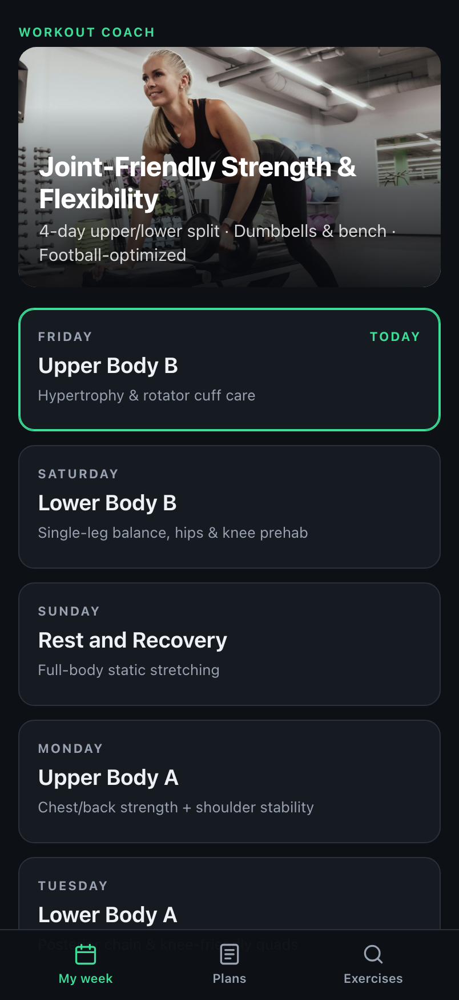
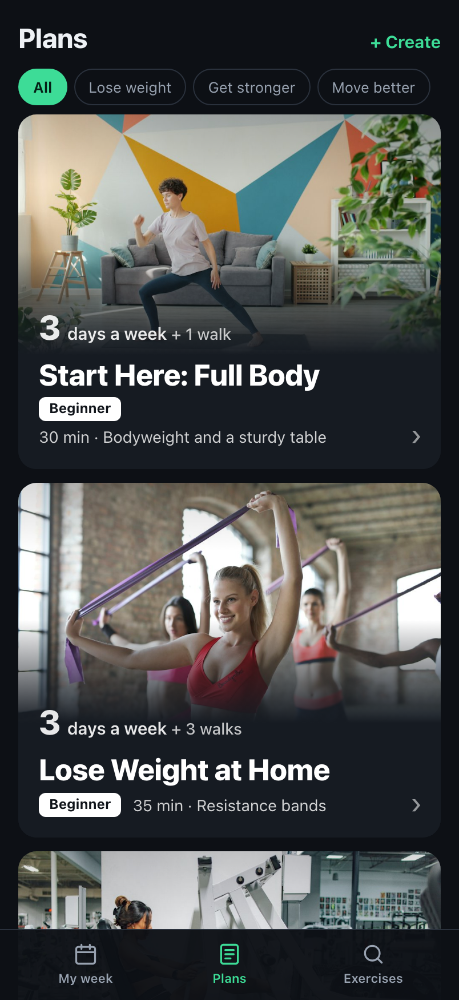
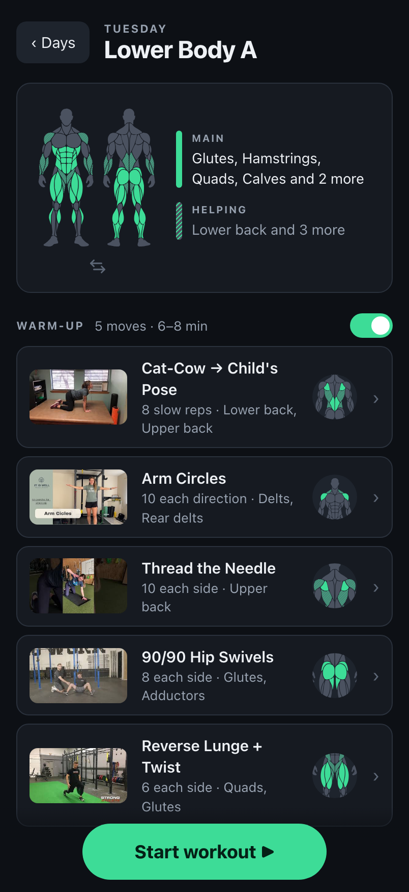
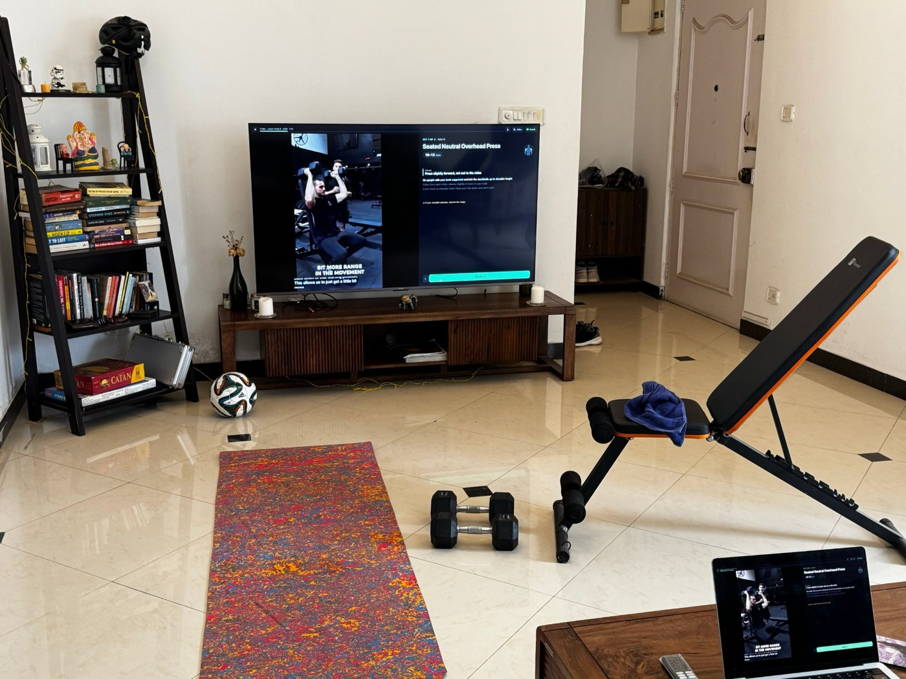

# Workout Coach

This is a small workout app for people who would rather press a button and get on with the workout than keep figuring out what comes next. It combines exercise demos, spoken instructions, rest timers and a little bit of context around the muscles and joints involved.

The intention is to make following a plan feel a little less intimidating. There are ready-made plans to start from, but the app is also designed so you can bring your own plan into it without having to learn how to code.

**Try it:** https://ashwinr93.github.io/workout/

<p>
  
  
  
</p>

## How I use it

I usually run it on my phone and mirror the screen to the TV while I work through the workout. The phone isn't particularly important though.. you can just use the app directly on your phone, laptop or whatever screen you have around.

This is basically what my setup looks like at home. Have used my laptop to mirror it this time so I could use my phone to click this photo 😛. I usually mirror the workout from my phone though so I can easily reach out and click next during the workout.



## Why this exists

Once I had the basic version working for myself, it felt a bit silly to keep it private. It's a fairly simple idea, and there are probably plenty of ways other people would want to structure their workouts differently. So I figured I'd put the whole thing out there and let people use it, break it, improve it or ignore most of it and take the bits they find useful.

## Make it yours

And for the curious, this was entirely vibe coded with Claude. I had the idea in my head, described what I wanted, and kept going back and forth with Claude until I had something I was happy with. It was a lot more fun than I expected!

So don't feel like you need to understand every line of code before touching this. Point Claude, Codex, Cursor or whichever coding agent you use at the repo and have a go. Change the exercises, the plans, the design or whatever else you fancy. And share the good bits back.

## Using it: tips

**Make it an app on your phone.**
- iPhone: open the site in Safari → Share → **Add to Home Screen** (keep "Open as Web App" on).
- Android: open it in Chrome → ⋮ → **Add to Home screen**.

It then opens full-screen like an app, with no browser bars.

**Put it on the TV.**
- iPhone to an AirPlay TV: turn **Rotation Lock off** and hold the phone sideways. Then open Control Center → **Screen Mirroring** and pick the TV. Landscape fills the TV.
- Android: use **Cast screen** / Smart View to a Chromecast or smart TV.
- A laptop works too: HDMI, or cast the browser tab.

**Control it from the phone.**
- **Done** ends a set and starts the rest.
- **‹** goes back a step, and **✕** (tap twice) leaves the workout.
- **‹ ›** at the top switch between alternate demo videos. Your choice is remembered per exercise.

**Pick one voice.**
- **Coach** (the default) talks you through the set.
- **Video** plays the demo's own audio. On demos with no voice, the coach fills in.
- Tap **Coach** again to silence everything.

**Warm-up and cool-down** are on by default. Turn either off with the switch in its section on the day screen, or tap **Skip warm-up** in the player once you're warm.

**Preview** any exercise by tapping it (on a day, or in the **Exercises** tab) to learn it before you start. The preview also shows its level, the kit it needs and which joints it's easy on or loads.

**The coach tells you what each exercise works** during the rest before it ("This one works your quads and glutes"), and the muscle figure on screen lights them up, so the gym words become familiar.

There are no accounts, no tracking and no ads (every demo video is checked for ads). Nothing leaves your phone except the YouTube embeds.

## Ready-made plans

The **Plans** tab has plans to start from, like a first full-body plan at home, losing weight with bands and walks, first steps in a gym, building muscle with dumbbells or in a gym, a desk worker's posture plan, a mobility plan and my own week. They're built from published guidance (ACSM progression models, Schoenfeld's work on training volume, the WHO activity guidelines). Filter by goal, open one to see each day, and tap **Start this plan** to make it your week. Browsing never changes your week, and switching asks first.

## Get your own plan (no code needed)

Tap **+ Create** on the Plans tab and pick the AI chat you already use. It opens a new chat with a message that turns the AI into a coach: it asks about your goals, any aches, where you train (at home or in a gym) and how much time you have, one question at a time, then gives you a link. Tap the link and your plan opens in the app, with the same videos, coach voice and timers.

- **It's free.** The AI runs on your own account; this site has no server.
- **Your plan lives in its link.** Bookmark it or add it to your Home Screen. The app also remembers the last plan you opened on that phone.
- **Private.** Your answers stay in your AI chat. The link holds only exercise names and numbers, and the part after `#` is never sent to any server.
- **Changing it later:** on My week, tap **Change or share this plan → Change it with AI**. The AI gets your current plan and gives you a new link. **Share** sends the link to a friend, and it opens the same plan for them.
- **Your plans** on the Plans tab keeps the plans you've made, each with its own card, so you can switch back anytime.
- **Cardio and sport** become activity days (a walk, a run, your football match), with the warm-up before and the stretches after.
- If an AI makes a mistake in the link, the app says what's wrong and gives you a message to paste back into the chat.

Some chats open with the message ready (ChatGPT, and Claude once you're signed in). For the rest, the app copies the message and you paste it in. If the chat shows your link as plain text rather than a link you can tap, copy it: back in the app, Create asks for it.

The AI can only choose from the app's exercise library, where every exercise has a checked demo video, cues that match it and a recorded coach voice. The library is growing.

## Under the hood

If you'd rather run your own copy (your own exercises, videos and wording), fork this repo. There's no build step: it's plain HTML, CSS and JavaScript.

| File | What's in it |
|---|---|
| [`library.js`](library.js) | Every exercise: name, cues, safety line, demo videos, default sets/reps; the warm-up, cool-down and activities |
| [`plan.js`](plan.js) | The plan link format, and the example plan the app opens with (`EXAMPLE_PLAN`) |
| [`speech.js`](speech.js) | Everything the coach says, and how names are pronounced (`SPOKEN_NAMES`) |
| [`prompt.js`](prompt.js) | The message that turns an AI chat into a coach that writes plans |
| [`programs.js`](programs.js) | The ready-made plans on the Plans tab, and their photos (saved in `photos/` by `tools/photos.mjs`) |

The easiest way is to hand the job to an AI coding assistant such as [Claude Code](https://claude.com/claude-code). [`CLAUDE.md`](CLAUDE.md) already explains how the app is built and the rules that keep it good: one movement per exercise, cues that match the demo, ad-free videos, and wording that sounds natural out loud.

### A plan

A plan is one line, the same one the AIs write:

```
v1/t:Home-Strength/mon:Full-Body-A:boxsquat.3x10-12,sarow.3x10,planktaps.3x30s/wed:Brisk-Walk:walk.30m/sun:Stretch:couch.1x60s
```

Each day is `mon`…`sun`, a name, then exercises as `id.SETSxREPS` (or a range like `10-12`), `id.SETSxSECONDSs` for holds, or one activity like `walk.30m`. Put yours in `EXAMPLE_PLAN` to make it the one the app opens with, or just open `your-site/#` followed by the line.

### An exercise

```js
rdl: {
  name: "Romanian Deadlift", sets: 3, reps: "8–10", unit: "reps", rest: 90,   // defaults; plans set their own
  equip: "dumbbells", type: "hinge", level: "intermediate",                  // what the AI sees
  easyOn: ["knees"], loads: ["lowerback"], easier: ["slbridge", "sumodl"],
  muscles: { main: ["hams", "glutes"], help: ["lowerback", "forearms", "adductors"] },
  key: "Hinge at the hips with soft knees",               // the Focus: the one thing that matters most
  cues: ["Stand tall with your chest up and core tight",    // in the order the demo shows them
         "Push your hips back as if touching a wall behind you", "..."],
  stop: "If you feel it in your lower back, stop before your back rounds.",
  videos: [{ id: "YouTube id", start: 5, end: 40 }]       // main demo first, then alternates
},
```

Holds use `time: 30` (seconds) instead of `reps`. Add `perSide: true` for one side at a time, `type: "stretch"` for stretches, and `voice: true` to a video when someone talks in it.

### The coach's voice

It works straight away: any phrase without a recording is spoken by the phone's built-in voice. For the natural voice you hear on the live site, record your phrases with the free, offline [Kokoro](https://github.com/thewh1teagle/kokoro-onnx) model. Setup is in the header of [`tools/make_audio.py`](tools/make_audio.py):

```bash
.venv/bin/python tools/make_audio.py --models <folder with the Kokoro model files>
```

It records only new or changed phrases (including every rep count and hold time a plan can ask for) and removes clips you no longer use.

### Publish it for free

In your fork on GitHub, go to **Settings → Pages → Source: GitHub Actions**. The included workflow ([`.github/workflows/pages.yml`](.github/workflows/pages.yml)) publishes `main` at `https://<you>.github.io/<repo>/`, and a `staging` branch, if you make one, at `…/staging/` for trying changes on your phone first. Each release's files are stamped with its commit, so phones never mix old and new files.

### Check it

- Add `?selftest` to your site's address (or run `python3 -m http.server` in the folder and open `localhost:8000/?selftest`). It runs every day's session in seconds on a simulated clock and checks the timing, the sound buttons, the wording, the plan links and whether the layout fits a phone. (Until you record your own voice clips, it will list the phrases without a recording.)
- [`tests/e2e`](tests/e2e) has deeper checks with real browsers and real YouTube, plus an ad scanner for demo videos (`ad-scan.mjs`). [`screenshots.mjs`](tests/e2e/screenshots.mjs) regenerates the images in this README. [`review.mjs`](tests/e2e/review.mjs) takes every screen on desktop, iPhone portrait and landscape before you publish a visual change.

## A note on safety

This is a player for a plan, not medical advice. The cues and "back off" lines come from my plan and the demo videos, and the AI is told to send anyone with warning signs (chest pain, dizziness, recent surgery, severe pain) to a doctor or physiotherapist first. If you have an injury, get your plan from a professional.

## Demo videos

<!-- credits:start -->
Every demo is the creator's own video, played through YouTube's embedded player (start and end points only; nothing is downloaded or edited). Thank you to these 58 channels:

- **[Advanced Therapy and Performance](https://www.youtube.com/@advancedtherapyperformance)**: [90/90 Hip Swivels](https://www.youtube.com/watch?v=YxECcOkUCEY)
- **[Andrew Coates](https://www.youtube.com/@Andrewcoatesfitness)**: [Neutral-Grip Incline Press](https://www.youtube.com/watch?v=2SU_K4-knrc)
- **[Atomic Athlete](https://www.youtube.com/@atomic.athlete)**: [Pigeon Pose](https://www.youtube.com/watch?v=1o7awuDGzag)
- **[Average To Jacked](https://www.youtube.com/@Averagetojacked)**: [Barbell Overhead Press](https://www.youtube.com/watch?v=afR3tPH6y_g)
- **[BEN MIGHTY](https://www.youtube.com/@BENMIGHTY85)**: [Chest-Supported Incline Row](https://www.youtube.com/watch?v=ym-Mp8tCF00)
- **[BESS - British Elbow & Shoulder Society](https://www.youtube.com/@bess-upper-limbs)**: [Wall Slides](https://www.youtube.com/watch?v=Eaj_NG5_hIo)
- **[BluePhoenix Fitness](https://www.youtube.com/@bluephoenixfitness)**: [Band Pulldown](https://www.youtube.com/watch?v=84D8bVJWB3s), [Band Seated Row](https://www.youtube.com/watch?v=b3035OyY4c8)
- **[Brian DeBaets](https://www.youtube.com/@briandebaets3041)**: [Box Squat to Bench](https://www.youtube.com/watch?v=DqWrOnzZ5No)
- **[Brittany Kohnke](https://www.youtube.com/@TheBrittanyKohnke)**: [Y-T-W Raises](https://www.youtube.com/watch?v=OFQduBFpDrY)
- **[Broser Built](https://www.youtube.com/@BroserBuilt)**: [Incline Hammer Curls](https://www.youtube.com/watch?v=cbRSu8Ws_hs)
- **[Buff Bandit](https://www.youtube.com/@buffbandit6575)**: [Band Seated Row](https://www.youtube.com/watch?v=aafaCFMvDKk)
- **[California Department of Public Health](https://www.youtube.com/@CAPublicHealth)**: [Cat-Cow → Child's Pose](https://www.youtube.com/watch?v=vuyUwtHl694)
- **[Cassi Niemann](https://www.youtube.com/@CassiNiemann)**: [Table Row](https://www.youtube.com/watch?v=DfVqXebqoaw)
- **[Catalyst Physical Therapy & Wellness](https://www.youtube.com/@catalystptandwellness)**: [Figure-4 Stretch](https://www.youtube.com/watch?v=xVq2-g_leTI)
- **[Champion Physical Therapy and Performance](https://www.youtube.com/@championptp)**: [Suitcase Carries](https://www.youtube.com/watch?v=3RKKnZhhelE)
- **[Dr. Christy Lee](https://www.youtube.com/@itiswellptllc)**: [Arm Circles](https://www.youtube.com/watch?v=ndmSvkEdNQQ)
- **[FITBODY with Julie Lohre](https://www.youtube.com/@FITBODYLifestyle)**: [Leg Extension](https://www.youtube.com/watch?v=EAR4tit2Dac)
- **[FITTR](https://www.youtube.com/@FITTRwithSquats)**: [Reverse Lunges](https://www.youtube.com/watch?v=RZKXLMxPF_I)
- **[Forest Gate Therapy Inc.](https://www.youtube.com/@forestgatetherapyinc.)**: [Barbell Bench Press](https://www.youtube.com/watch?v=xS3MqdFppiY)
- **[Girls Gone Strong \| Women's Health & Fitness](https://www.youtube.com/@GirlsGoneStrong)**: [Bodyweight Squat](https://www.youtube.com/watch?v=3fl7uYmiMVw)
- **[Hinge Health](https://www.youtube.com/@hingehealth)**: [Split Squat](https://www.youtube.com/watch?v=qW5OGJ62ZjY), [Push-Up](https://www.youtube.com/watch?v=ZR1QBUtC1GY), [Dead Bug](https://www.youtube.com/watch?v=GbSC02oU3To), [Bird Dog](https://www.youtube.com/watch?v=xEDnlOxeJH4)
- **[Hubert Physical Therapy](https://www.youtube.com/@HubertPT)**: [Hamstring Doorway Stretch](https://www.youtube.com/watch?v=b7k-9CZVYbA)
- **[IronmasterPro](https://www.youtube.com/@IronmasterPro)**: [Standing Calf Raises](https://www.youtube.com/watch?v=SRUtMJ0tE2A), [Goblet Squat](https://www.youtube.com/watch?v=2LnkzQ7paAc)
- **[Jacobs Fitness](https://www.youtube.com/@jacobs_fitness)**: [Floor Triceps Extensions](https://www.youtube.com/watch?v=Py4I0J6i2kY)
- **[Joanna Soh](https://www.youtube.com/@ExerciseLibraryJoannaSoh)**: [Plank with Shoulder Taps](https://www.youtube.com/watch?v=0PrTUpElJ44)
- **[kafetters](https://www.youtube.com/@kafetters)**: [Goblet Deadlift](https://www.youtube.com/watch?v=TC2jOPCNYhU)
- **[ken whittier](https://www.youtube.com/@kenwhittier7243)**: [Suitcase Carries](https://www.youtube.com/watch?v=bAnCoDrvXc4)
- **[Lamiss Fitness](https://www.youtube.com/@lamissfitness3102)**: [Low-Impact Jacks](https://www.youtube.com/watch?v=0N6_Pqk5DPI)
- **[Luke Briggs](https://www.youtube.com/@lukebriggs3231)**: [Floor Press](https://www.youtube.com/watch?v=IaY4EncHDHU)
- **[Medibank](https://www.youtube.com/@medibank)**: [90/90 Hip Swivels](https://www.youtube.com/watch?v=F1XdXdCjERk)
- **[MedStar Health](https://www.youtube.com/@medstarhealth)**: [Single-Leg Glute Bridge](https://www.youtube.com/watch?v=AVAXhy6pl7o)
- **[Men's Health](https://www.youtube.com/@menshealthmag)**: [Couch Stretch](https://www.youtube.com/watch?v=Fg-lwNBzVV8), [Bench Pullovers](https://www.youtube.com/watch?v=FK4rHfWKEac)
- **[Middlebury College](https://www.youtube.com/@middlebury_college)**: [Single-Leg Glute Bridge](https://www.youtube.com/watch?v=vdmlNaXSjd4)
- **[MidwestOrtho](https://www.youtube.com/@MidwestOrtho)**: [Doorway Chest Stretch](https://www.youtube.com/watch?v=CEQMx4zFwYs)
- **[MyChart - Scottish Rite for Children](https://www.youtube.com/@MyChartScottishRiteforChildren)**: [Hamstring Doorway Stretch](https://www.youtube.com/watch?v=VWk9QD10Xjg)
- **[Online Strength Training for Cyclists](https://www.youtube.com/@fastfitstrong)**: [Reverse Lunge + Twist](https://www.youtube.com/watch?v=UuBs5AqO3JY)
- **[Onnit Academy](https://www.youtube.com/@OnnitAcademy)**: [Romanian Deadlift](https://www.youtube.com/watch?v=xAL7lHwj30E), [Floor Pullovers](https://www.youtube.com/watch?v=qALakTR1nRI)
- **[OPEX Fitness](https://www.youtube.com/@OPEXFitness)**: [Neutral-Grip Incline Press](https://www.youtube.com/watch?v=g4tj2lnUgpM), [Floor Press](https://www.youtube.com/watch?v=oqnNivBhveM), [Standing Calf Raises](https://www.youtube.com/watch?v=ADIDoYt_ko4), [Incline Hammer Curls](https://www.youtube.com/watch?v=1Z6XiaBxwHQ), [Overhead Triceps Extensions](https://www.youtube.com/watch?v=HADoxgsslvw), [Incline Push-Up](https://www.youtube.com/watch?v=E--Ls5QtFqI)
- **[Prime Health Co.](https://www.youtube.com/@primehealthco_)**: [McGill Curl-Up](https://www.youtube.com/watch?v=I_drRVYlHbc)
- **[PrimeMVMNT](https://www.youtube.com/@PrimeMVMNT)**: [Tibialis Raises](https://www.youtube.com/watch?v=nQKgHwi8W9E)
- **[PureGym](https://www.youtube.com/@PureGymVideo)**: [Single-Arm Row](https://www.youtube.com/watch?v=ZRSGpBUVcNw), [Step-Ups](https://www.youtube.com/watch?v=DxUNi119Qzs), [Glute Bridge](https://www.youtube.com/watch?v=tqp5XQPpTxY), [Leg Press](https://www.youtube.com/watch?v=p5dCqF7wWUw), [Machine Chest Press](https://www.youtube.com/watch?v=sqNwDkUU_Ps)
- **[React Physical Therapy](https://www.youtube.com/@ReactPhysicalTherapyChicago)**: [Cross-Body Shoulder Stretch](https://www.youtube.com/watch?v=aIq0fLi8iak), [Overhead Triceps Stretch](https://www.youtube.com/watch?v=_IOHtPSYGbk)
- **[Rehab My Patient](https://www.youtube.com/@RehabMyPatient)**: [Kneeling Side Plank](https://www.youtube.com/watch?v=UurF0EhHFLg)
- **[Renaissance Periodization](https://www.youtube.com/@RenaissancePeriodization)**: [Single-Arm Row](https://www.youtube.com/watch?v=DMo3HJoawrU), [Face Pulls](https://www.youtube.com/watch?v=nzTY7j9ocR8)
- **[REP](https://www.youtube.com/@repfitnessequipment)**: [Seated Cable Row](https://www.youtube.com/watch?v=f_r95UajQcg)
- **[Runna](https://www.youtube.com/@Runna)**: [Bodyweight Squat](https://www.youtube.com/watch?v=P-yaD24bUE8), [Barbell Deadlift](https://www.youtube.com/watch?v=S5JSZKURFPo), [Barbell Bent-Over Row](https://www.youtube.com/watch?v=rqTOAM8WoeM)
- **[Simone Sports Performance](https://www.youtube.com/@SimoneSportsPerformance)**: [Y-T-W Raises](https://www.youtube.com/watch?v=WAnSCSJbQYw)
- **[Steam Training Fitness](https://www.youtube.com/@steamtrainingfitness720)**: [Sumo Deadlift](https://www.youtube.com/watch?v=xK4ED_yQcoU)
- **[Streamline Performance Physical Therapy](https://www.youtube.com/@ptstreamline)**: [Thread the Needle](https://www.youtube.com/watch?v=YuAJ1i76Hek)
- **[STRONG ATHLETE](https://www.youtube.com/@StrongAthlete)**: [Reverse Lunge + Twist](https://www.youtube.com/watch?v=LrIE5onzj68)
- **[Sworkit](https://www.youtube.com/@SworkitHealth)**: [Arm Circles](https://www.youtube.com/watch?v=UVMEnIaY8aU)
- **[Tangelo - Seattle Chiropractor + Rehab](https://www.youtube.com/@Tangelohealth)**: [Band Pull-Aparts](https://www.youtube.com/watch?v=stwYTTPXubo), [Couch Stretch](https://www.youtube.com/watch?v=fHKndvWwenc)
- **[The Hybrid Headquarters](https://www.youtube.com/@TheHybridHeadquarters)**: [Seated Neutral Overhead Press](https://www.youtube.com/watch?v=7oH0algsdww)
- **[The Physical Therapy and Wellness Channel](https://www.youtube.com/@EWphysicaltherapyandwellness)**: [Barbell Back Squat](https://www.youtube.com/watch?v=ZaSetOZFo-k)
- **[Three Lakes Physical Therapy](https://www.youtube.com/@threelakesphysicaltherapya927)**: [Cat-Cow → Child's Pose](https://www.youtube.com/watch?v=Kegpy6v-NfA)
- **[UC Davis Health](https://www.youtube.com/@UCDavisHealth)**: [Lat Pulldown](https://www.youtube.com/watch?v=oMJmAHRZXBk)
- **[Wade Bass](https://www.youtube.com/@Tglcoach)**: [Tibialis Raises](https://www.youtube.com/watch?v=OPEuhclsTUQ)
- **[YMCA Calgary](https://www.youtube.com/@ymcacalgary)**: [Seated Leg Curl](https://www.youtube.com/watch?v=TAbolZJ6Lg4)

The plan photos come from [Unsplash](https://unsplash.com) (free to use under the [Unsplash License](https://unsplash.com/license)) (copies are saved in `photos/`). Thank you to these photographers:

- [Start Here: Full Body](https://unsplash.com/photos/funsezUxxe4) by Vitaly Gariev
- [Lose Weight at Home](https://unsplash.com/photos/oLStrTTMz2s) by bruce mars
- [Gym First Steps](https://unsplash.com/photos/SMSpk9fprcU) by Nate Johnston
- [Build Muscle: Dumbbells](https://unsplash.com/photos/1P2iWpwuNAs) by Vitaly Gariev
- [Build Muscle: Gym](https://unsplash.com/photos/3jAN9InapQI) by Cathy Pham
- [Barbell Strength Basics](https://unsplash.com/photos/IYLLF511aOY) by Land O'Lakes, Inc.
- [Desk Worker: Posture and Back](https://unsplash.com/photos/07mA-tEIJ6A) by Vitaly Gariev
- [Joint-Friendly Strength & Flexibility](https://unsplash.com/photos/z9VbZ4tM3Zc) by Michael Faix
- [Mobility and Recovery](https://unsplash.com/photos/EUk6LRg9alk) by Vitaly Gariev
- [Your own plans (bodyweight)](https://unsplash.com/photos/cr1x1-_EUbw) by Vitaly Gariev
- [Your own plans (bands)](https://unsplash.com/photos/kB4FXX1KXhQ) by Centre for Ageing Better
- [Your own plans (dumbbells)](https://unsplash.com/photos/1lkg9MLl_rU) by engin akyurt
- [Your own plans (gym)](https://unsplash.com/photos/VgZsyPiZLKw) by Jonathan Borba
- [Your own plans (stretching)](https://unsplash.com/photos/893qZckG6I4) by THLT LCX
<!-- credits:end -->

Changed the videos? `node tools/credits.mjs` rebuilds this list.

## License

The code is [MIT](LICENSE): use it, change it, share it. The demo videos are not part of this repo; they belong to their creators.

---

Built with [Claude Code](https://claude.com/claude-code).
